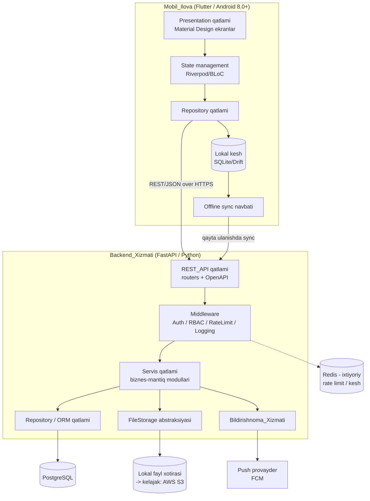
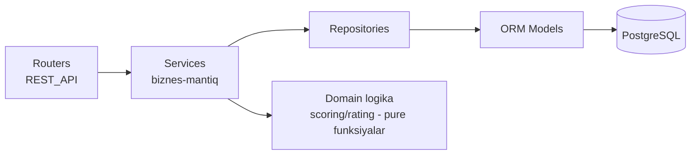
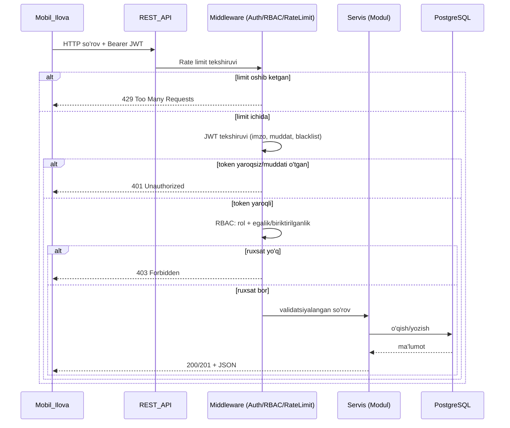
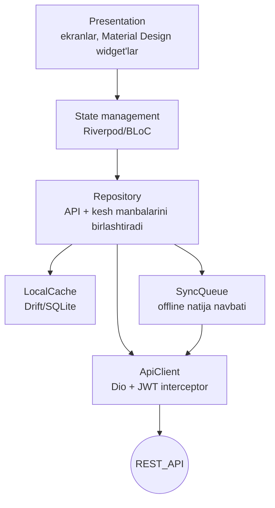
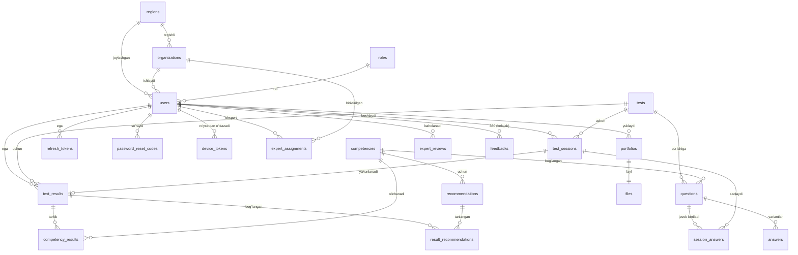
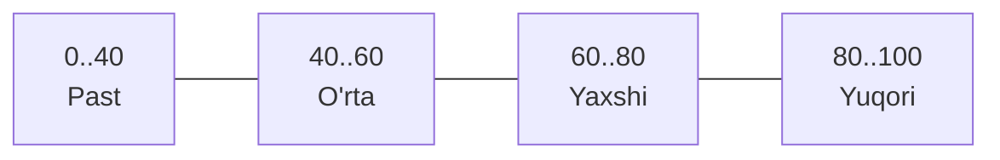
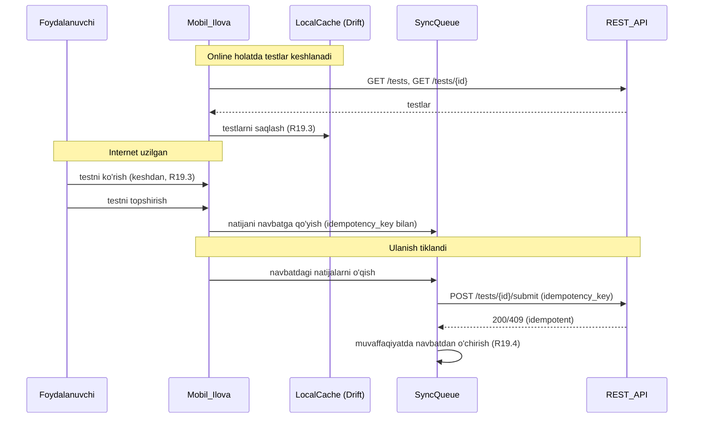
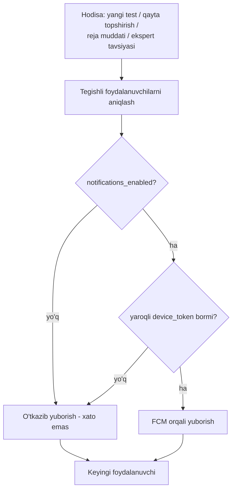

# Dizayn Hujjati: MTT Menejer Diagnostika

## Overview

_Umumiy ko'rinish_

"MTT Menejer Diagnostika" — maktabgacha ta'lim tashkiloti (MTT) rahbarlarining
intellektual va kasbiy kompetensiyalarini raqamli diagnostika qiluvchi, baholovchi
va monitoring qiluvchi tizim. Ushbu hujjat tasdiqlangan talablar
(`requirements.md`) asosida MVP arxitekturasini, texnologik stekni, komponentlar
interfeyslarini, ma'lumotlar modelini, REST API dizaynini, ball hisoblash
algoritmini, xavfsizlik yechimlarini, offline strategiyasini, push
bildirishnomalar dizaynini, korrektlik xususiyatlarini hamda test strategiyasini
belgilaydi.

Tizim uch qatlamli mantiqiy arxitekturaga ega:

- **Mobil_Ilova** (Android) — foydalanuvchi interfeysi va offline keshlash.
- **Backend_Xizmati** + **REST_API** — biznes-mantiq, autentifikatsiya, ball
  hisoblash, analitika, reyting, hisobotlar.
- **PostgreSQL** + **Fayl xotirasi** — doimiy saqlash.

### Dizayn maqsadlari

1. **Talablarga to'liq mosligi** — har bir komponent talablar hujjatidagi
   modullarga (Glossary'dagi `*_Moduli` nomlari) bevosita mos keladi.
2. **Korrektlik** — ball hisoblash, daraja aniqlash va reyting kabi mantiqiy
   yadro property-based test bilan tekshiriladi.
3. **Xavfsizlik** — JWT autentifikatsiya, parol xeshlash, RBAC, rate limiting va
   fayl validatsiyasi standart sifatida.
4. **Kengaytirilishi** — 360 daraja teskari aloqa, bulut fayl xotirasi (AWS S3)
   va boshqa post-MVP imkoniyatlar uchun arxitektura tayyor (Requirement 18).

### Talablarni dizaynga bog'lash (yuqori darajadagi xarita)

| Talab | Dizayn bo'limi / komponenti |
|-------|------------------------------|
| R1–R3 | Autentifikatsiya_Moduli (Auth), Security design |
| R4, R17 | RBAC qatlami, Security design |
| R5 | Profil_Moduli |
| R6, R7 | Diagnostika_Moduli, Test sessiya hayot sikli |
| R8 | Baholash_Moduli, Scoring algoritmi |
| R9 | Analitika_Moduli |
| R10 | Tavsiya_Moduli |
| R11 | Portfolio_Moduli, Fayl xotirasi abstraksiyasi |
| R12 | Reyting_Moduli |
| R13 | Ekspert_Moduli |
| R14 | Admin_Moduli |
| R15 | Hisobot_Moduli |
| R16 | Bildirishnoma_Xizmati (Push) |
| R18 | Data model kengaytirilishi, Fayl xotirasi abstraksiyasi |
| R19 | Mobil_Ilova qatlamlari, Offline & sync strategiyasi |
| R20 | REST API dizayni, OpenAPI hujjatlari |

## Architecture

_Arxitektura_

### Yuqori darajadagi arxitektura



### Backend ichki qatlamlari (clean / layered)



Asosiy tamoyil: **domen mantiqi (ball hisoblash, daraja aniqlash, reyting
saralash) sof funksiyalar sifatida ajratiladi** va I/O qatlamidan (DB, fayl,
tarmoq) mustaqil bo'ladi. Bu property-based testlarni I/O'siz, tez va ishonchli
ishlatishga imkon beradi (Testing Strategy bo'limiga qarang).

### So'rov oqimi (request flow)



## Technology Stack va asoslash

Talablar (TEXNIK TOPSHIRIQ) tezkor MVP yetkazib berish uchun **Flutter + FastAPI**
stekni tavsiya qiladi. Quyidagi tanlovni qabul qilamiz:

| Qatlam | Tanlov | Asoslash |
|--------|--------|----------|
| Mobil | **Flutter (Dart)** | Yagona kod bazasidan Android (8.0+) uchun tez yetkazib berish, Material Design'ni native qo'llab-quvvatlash (R19.2), boy diagramma kutubxonalari (radar/line chart — R9), kelajakda iOS'ga kengaytirish imkoni (R18.3). |
| Backend | **FastAPI (Python 3.11+)** | Avtomatik OpenAPI hujjatlari (R20.5), Pydantic orqali kuchli so'rov/javob validatsiyasi (R20.6), yuqori unumdorlik (async), sof funksiyalarni test qilish qulayligi. |
| ORM | **SQLAlchemy 2.x + Alembic** | Yetuk ORM va migratsiya boshqaruvi, referensial yaxlitlik (R14.8). |
| MB | **PostgreSQL 15+** | Tranzaksion yaxlitlik, ko'rsatkichli (rank) so'rovlar uchun window funksiyalar (R12), JSON maydonlar orqali kengaytirilish (R18.1). |
| Auth | **JWT (PyJWT) + bcrypt/argon2** | 15 daqiqa access / 30 kun refresh tokenlar (R2.1), parol xeshlash (R1.4, R17.1). |
| Fayl xotirasi | **FileStorage abstraksiyasi** (lokal FS -> S3) | MVP'da lokal, keyin AWS S3 (R18.2). |
| Rate limit / kesh | **Redis (ixtiyoriy) yoki in-memory** | Rate limiting (R17.3); MVP'da in-memory yoki Redis. |
| Push | **Firebase Cloud Messaging (FCM)** | Android push bildirishnomalar (R16). |
| Konteynerlash | **Docker + docker-compose** | Bir xil muhit, oson joylashtirish. |
| Mobil kesh | **Drift (SQLite) + secure storage** | Offline testlar keshlash va sync navbati (R19.3, R19.4), tokenlarni xavfsiz saqlash. |

> **Eslatma (native muqobil):** Talablar Kotlin + Django REST Framework muqobilini
> ham eslatadi. Biz tezroq yetkazib berish, avtomatik OpenAPI va sof domen mantiqini
> oson testlash sabablari bilan Flutter + FastAPI'ni tanladik. Domen mantiqi
> framework'dan ajratilgani uchun backend kelajakda boshqa stekka ko'chirilsa ham
> korrektlik testlari qayta ishlatilishi mumkin.

## Components and Interfaces

_Komponentlar va interfeyslar_

Quyida har bir backend moduli (Glossary nomlari bilan) javobgarligi, asosiy
operatsiyalari va bog'liq talablari keltirilgan. Servislar sof domen mantiqini
chaqiradi va repository orqali ma'lumotlarga kiradi.

### Autentifikatsiya_Moduli (AuthService)

**Javobgarlik:** ro'yxatdan o'tish, kirish, token yangilash, logout, parolni
tiklash, login bloklash. (R1, R2, R3, R17.1, R17.2)

Asosiy operatsiyalar:
- `register(payload) -> User` — telefon formati (+998, 13 belgi), parol uzunligi
  (8–64), majburiy maydonlar, rol validatsiyasi; parolni xeshlab saqlaydi
  (R1.1–R1.7, R1.4).
- `login(phone, password) -> TokenPair` — 5 marta noto'g'ri urinishdan keyin
  15 daqiqa bloklash (R2.7); xato xabari qaysi maydon noto'g'ri ekanini oshkor
  qilmaydi (R2.2).
- `refresh(refresh_token) -> AccessToken` — bekor qilingan/muddati o'tgan
  tokenni rad etadi (R2.3, R2.6).
- `logout(access_token, refresh_token)` — tokenlarni blacklistga qo'shadi (R2.4).
- `forgot_password(phone)` — 6 raqamli, 15 daqiqa amal qiladigan kod; mavjud
  bo'lmagan raqam uchun bir xil umumiy javob (R3.1, R3.2).
- `reset_password(phone, code, new_password)` — kodni tekshiradi, parolni
  yangilaydi, kodni bekor qiladi; 5 dan ortiq noto'g'ri urinishda kodni bekor
  qiladi (R3.3–R3.7).

### Profil_Moduli (ProfileService)

**Javobgarlik:** profil ko'rish va tahrirlash. (R5)

- `get_profile(user_id) -> Profile` — to'liq profil maydonlarini qaytaradi (R5.1).
- `update_profile(user_id, patch) -> Profile` — tahrirlanadigan maydonlarni
  yangilaydi; ish staji 0–60 butun son, matn maydonlari ≤200 belgi (R5.2, R5.3);
  telefon raqamini o'zgartirishni rad etadi (R5.4).

### Diagnostika_Moduli (TestService / SessionService)

**Javobgarlik:** testlar ro'yxati, test tafsilotlari, sessiya hayot sikli. (R6, R7)

- `list_tests() -> [TestSummary]` — faqat `is_active = true` testlar; bo'sh bo'lsa
  bo'sh ro'yxat (R6.1, R6.5).
- `get_test(test_id) -> TestDetail` — savollar va variantlar belgilangan
  tartibda; mavjud/faol bo'lmasa 404 (R6.3, R6.4).
- `start_test(user_id, test_id) -> Session` — tugatilmagan sessiya bo'lmasa yangi
  yaratadi; bo'lsa mavjudini davom ettiradi (R7.1, R7.10).
- `submit_test(user_id, session_id, answers) -> Result` — javoblarni saqlaydi,
  sessiyani yakunlaydi, Baholash_Moduliga uzatadi; takroriy topshirishni rad
  etadi (idempotent — R7.6, R7.7); javobsiz savollar bo'lsa va muddat tugamagan
  bo'lsa rad etadi (R7.8); begona/yo'q sessiya 404 (R7.9).
- `auto_finish(session_id)` — muddat tugaganda avtomatik yakunlash, javobsiz
  savollarni belgilash (R7.5).

### Baholash_Moduli (ScoringService) — domen yadrosi

**Javobgarlik:** ball, foiz va daraja hisoblash. Sof funksiyalar to'plami. (R8)

- `compute_percentage(collected, max) -> float` — `collected/max*100`, 2 kasr,
  `max==0 -> 0.0` (R8.1, R8.8).
- `determine_level(percentage) -> Level` — uzluksiz oraliqlar (R8.2).
- `compute_competency_scores(answers, questions) -> [CompetencyResult]` —
  kompetensiya bo'yicha foizlar; bog'lanmagan savollar chetda (R8.3, R8.5).
- `build_result(...) -> TestResult` — umumiy ball, kompetensiya ballari, kuchli/
  zaif tomonlar, qayta topshirish sanasi (R8.4, R8.6, R8.7).

### Analitika_Moduli (AnalyticsService)

**Javobgarlik:** grafik ma'lumotlar va o'sish dinamikasi. (R9)

- `get_my_analytics(user_id) -> Analytics` — umumiy ball, kompetensiya taqsimoti
  (radar/progress/line/card uchun ma'lumot), xronologik o'sish dinamikasi (R9.1,
  R9.2).
- O'sish farqi: joriy vs bevosita oldingi natija (R9.3); bitta natija bo'lsa farq
  "mavjud emas" (R9.4); kuchli/zaif kompetensiya, teng qiymatlarda barchasi
  (R9.5, R9.6); natija yo'q bo'lsa muvaffaqiyatli bo'sh holat (R9.7).

### Tavsiya_Moduli (RecommendationService)

**Javobgarlik:** kompetensiya+daraja bo'yicha tavsiya tanlash va saqlash. (R10)

- `assign_recommendations(result) -> [Recommendation]` — natija hisoblanganda
  avtomatik tanlanadi va natijaga bog'lanib saqlanadi; mos tavsiya bo'lmasa
  umumiy standart tavsiya (R10.1, R10.4).
- `get_my_recommendations(user_id)` / `get_by_result(user_id, result_id)` —
  egalik tekshiruvi bilan (R10.2, R10.3, R10.6); natija yo'q bo'lsa bo'sh holat
  (R10.5).

### Portfolio_Moduli (PortfolioService)

**Javobgarlik:** fayl yuklash, ro'yxat, o'chirish. (R11)

- `list_portfolio(user_id)` — yaratilgan sana bo'yicha kamayish tartibida (R11.1).
- `upload(user_id, file, title)` — PDF/JPG/PNG/DOC/DOCX, ≤10 MB (10 485 760 bayt),
  nom 1–200 belgi; fayl turi va hajmini tekshiradi (R11.2, R11.3, R11.4, R17.4).
- `delete(user_id, portfolio_id)` — egalik tekshiruvi (R11.5, R11.6); yo'q bo'lsa
  404 (R11.7). Fayl `FileStorage` abstraksiyasi orqali o'chiriladi.

### Reyting_Moduli (RatingService) — domen yadrosi

**Javobgarlik:** umumiy/hudud/tashkilot/kompetensiya reytingi. Sof saralash
mantiqi. (R12)

- `compute_ranking(records) -> [RankedEntry]` — umumiy foiz bo'yicha kamayuvchi
  saralash; dense/standard rank, teng qiymatlarda bir xil rank va keyingi o'rinni
  o'tkazib yuborish, teng yozuvlarni sana bo'yicha o'suvchi tartiblash (R12.1,
  R12.2, R12.3).
- Anonimlashtirish: faqat hudud, tashkilot turi, lavozim, ko'rsatkich, rank;
  so'rovchining yozuvini ajratadi (R12.4); natijasiz foydalanuvchi reytingdan
  tashqarida (R12.5).

### Ekspert_Moduli (ExpertReviewService)

**Javobgarlik:** ekspert tomonidan rahbarni 6 mezon bo'yicha baholash. (R13)

- `submit_review(expert_id, leader_id, scores) -> ExpertReview` — 6 mezon, har
  biri 1–5 butun son; o'rtacha 1.00–5.00 (R13.1, R13.2); yaroqsiz qiymat yoki
  to'liqsiz mezon rad etiladi (R13.3, R13.4); biriktirilmagan tashkilot 403
  (R13.5); qo'shilgach push (R13.6).

### Admin_Moduli (AdminService)

**Javobgarlik:** kontent CRUD, validatsiya, referensial yaxlitlik. (R14)

- Test/savol/kompetensiya/tavsiya CRUD (R14.1–R14.4).
- Test validatsiyasi: nom 1–200, toifa yaroqli, davomiyligi 1–600 butun (R14.2).
- Savol validatsiyasi: matn 1–1000, ≥2 variant, ball 0.01–1000 musbat, mavjud
  kompetensiyaga bog'lash (R14.3, R14.7).
- Admin bo'lmagan rad etiladi (R14.5); yaroqsiz qiymat validatsiya xatosi (R14.6);
  ishlatilayotgan kompetensiyani o'chirish rad etiladi (R14.8).

### Hisobot_Moduli (ReportService)

**Javobgarlik:** jamlangan hisobotlar. (R15)

- `admin_report()` — rahbarlar soni, test topshirganlar soni, o'rtacha ball,
  eng past/yuqori kompetensiyalar (R15.1, R15.2).
- `report_by_region()` / `report_by_organization()` (R15.3, R15.4).
- `individual_dynamics(leader_id)` — xronologik (R15.5).
- Ekspert uchun faqat biriktirilgan tashkilotlar (R15.6); natija yo'q bo'lsa nol
  qiymatli bo'sh holat (R15.7).

### Bildirishnoma_Xizmati (NotificationService)

**Javobgarlik:** push bildirishnomalar. (R16)

- `notify_new_test`, `notify_retake`, `notify_dev_plan_deadline`,
  `notify_expert_recommendation` — push o'chirilgan yoki qurilma tokeni yo'q
  foydalanuvchilarni o'tkazib yuboradi va boshqalarni davom ettiradi (R16.1–R16.6).

### REST_API qatlami va Middleware

- **AuthMiddleware** — JWT imzo/muddat/blacklist tekshiruvi (R2.5, R17.2).
- **RBACGuard** — rol + egalik/biriktirilganlik (R4).
- **RateLimitMiddleware** — joriy oyna bo'yicha 429 (R17.3).
- **LoggingMiddleware** — maxfiy ma'lumotlarni jurnaldan chiqaradi (R17.5).
- **OpenAPI** — avtomatik mashina o'qiy oladigan hujjatlar (R20.5).

### Mobil_Ilova qatlamlari (Flutter)



- **ApiClient** — JWT'ni avtomatik biriktiradi, 401'da refresh oqimini boshqaradi.
- **LocalCache** — yuklangan testlarni keshlaydi (R19.3).
- **SyncQueue** — offline topshirilgan natijalarni navbatga oladi va ulanish
  tiklanganda yuboradi (R19.4).
- **UI** — Android 8.0+ va Material Design (R19.1, R19.2); analitika diagrammalari
  (R9.2).

### Komponent interfeyslari (servis shartnomalari xulosasi)

Quyida glossariydagi har bir komponent (modul) backend mas'uliyatlari, asosiy
interfeyslari va u qondiradigan talablar bilan tavsiflanadi (backend modullari).

#### Autentifikatsiya_Moduli (R1, R2, R3, R17.1, R17.2)

Mas'uliyat: ro'yxatdan o'tish, kirish, token yangilash/bekor qilish, parolni tiklash,
login lockout.

Asosiy interfeys (servis darajasi):

```
register(payload: RegisterRequest) -> AuthUser            # R1
login(phone, password) -> TokenPair                       # R2.1
refresh(refresh_token) -> AccessToken                     # R2.3
logout(access_token, refresh_token) -> None               # R2.4
request_password_reset(phone) -> GenericOK                # R3.1, R3.2
confirm_password_reset(phone, code, new_password) -> OK   # R3.3..R3.7
```

Qoidalar: parol `bcrypt`/`argon2` bilan xeshlanadi (R1.4, R17.1); telefon raqami
formati `+998` + jami 13 belgi (R1.6); rol whitelisti `{Rahbar, Ekspert,
Administrator}` (R1.7); 5 ta noto'g'ri urinishdan keyin 15 daqiqa bloklash (R2.7);
parolni tiklashda akkaunt mavjudligini oshkor qilmaslik (R3.2).

#### Profil_Moduli (R5)

Mas'uliyat: profil ko'rish va tahrirlash; telefon raqami (hisob identifikatori)
o'zgartirilmasligini ta'minlash (R5.4); ish staji 0–60 va matn maydonlari ≤200 belgi
validatsiyasi (R5.3). Profil ma'lumoti natija tahlilida kontekst sifatida ishlatiladi
(R5.5).

```
get_profile(user_id) -> Profile
update_profile(user_id, ProfilePatch) -> Profile
```

#### Diagnostika_Moduli (R6, R7)

Mas'uliyat: faol testlar ro'yxati va toifalash (R6.1, R6.2); test tafsilotlari va
savollar (R6.3); sessiya boshqaruvi (R7.1, R7.10); Likert va case-study taqdimoti
uchun metama'lumot (R7.3, R7.4); muddat tugashida avto-yakunlash (R7.5); topshirish va
takroriy topshirishni rad etish (R7.6, R7.7, R7.8).

```
list_tests() -> [TestSummary]                       # R6.1, R6.5
get_test(test_id) -> TestDetail                      # R6.3, R6.4
start_session(user_id, test_id) -> Session           # R7.1, R7.10
submit_session(user_id, session_id, answers) -> Result  # R7.5..R7.9
```

#### Baholash_Moduli (R8)

Mas'uliyat: umumiy foiz, kompetensiya foizi, daraja, kuchli/zaif tomonlar, qayta
topshirish sanasi; bog'lanmagan savollarni va `max=0` holatini xavfsiz boshqarish.
Algoritm "Scoring & Recommendation Logic" bo'limida batafsil. Saqlash: `test_results`,
`competency_results` (R8.6).

```
score_session(session) -> ScoredResult              # R8.1..R8.8
get_result(result_id, requester) -> Result | Partial # R8.7
```

#### Analitika_Moduli (R9) va Reyting_Moduli (R12)

Analitika: umumiy ball, kompetensiya taqsimoti, o'sish dinamikasi (xronologik),
oldingi natija bilan farq, eng kuchli/rivojlantirilishi lozim kompetensiya, bo'sh
holat (R9.1–R9.7). Grafiklar uchun (radar, progress bar, line chart, kartochka)
ma'lumot tayyorlaydi (R9.2).

Reyting: umumiy/hudud/tashkilot/kompetensiya bo'yicha reyting, kamayuvchi tartib,
teng o'rinlarni boshqarish, anonimlik (R12.1–R12.5).

```
get_analytics(user_id) -> AnalyticsPayload          # R9
get_org_analytics(org_id, requester) -> ...          # R15.4
get_region_analytics(region_id, requester) -> ...    # R15.3
get_ratings(scope, requester) -> [RatingEntry]       # R12
```

#### Tavsiya_Moduli (R10)

Mas'uliyat: natija hisoblanganda (kompetensiya, daraja) bo'yicha tavsiyani avto-tanlash
va natijaga bog'lash; mos tavsiya yo'q bo'lsa standart tavsiya (R10.4); bo'sh holat
(R10.5); egalik tekshiruvi (R10.6).

```
attach_recommendations(result) -> None              # R10.1, R10.4
get_my_recommendations(user_id) -> [Recommendation]  # R10.2, R10.5
get_recommendations_by_result(result_id, requester) -> ... # R10.3, R10.6
```

#### Portfolio_Moduli (R11, R17.4)

Mas'uliyat: portfolio yozuvlari ro'yxati (kamayish tartibida), fayl yuklash
(turi + hajm validatsiyasi), o'chirish (egalik tekshiruvi). Fayl `FileStorage`
abstraksiyasi orqali saqlanadi.

```
list_portfolio(user_id) -> [PortfolioItem]          # R11.1
upload(user_id, name, file) -> PortfolioItem         # R11.2, R11.3, R11.4
delete(user_id, item_id) -> None                     # R11.5, R11.6, R11.7
```

#### Ekspert_Moduli (R13)

Mas'uliyat: 6 mezon bo'yicha 1–5 baholash, o'rtacha (1.00–5.00, 2 kasr), biriktirilganlik
tekshiruvi, bildirishnoma yuborish.

```
submit_review(expert_id, leader_id, scores6) -> ExpertReview  # R13.1..R13.6
```

#### Admin_Moduli (R14) va Hisobot_Moduli (R15)

Admin: foydalanuvchi/test/savol/kompetensiya/... CRUD; test va savol validatsiyasi;
kompetensiya referensial yaxlitligi (R14.8). Hisobot: jamlangan ko'rsatkichlar,
hudud/tashkilot kesimi, individual dinamika, ekspert doirasi cheklovi, bo'sh holat.

```
admin_list_users() / admin_list_results()           # R14.1, R20.4
admin_create_test(TestInput) / patch / delete        # R14.2, R14.4
create_question / patch_question / delete_question    # R14.3, R14.6, R14.7
admin_report() / region_report() / org_report()      # R15
```

#### Bildirishnoma_Xizmati (R16)

Mas'uliyat: yangi test, qayta diagnostika sanasi, reja muddati (-3 kun), ekspert
tavsiyasi hodisalarida FCM orqali push yuborish; push o'chirilgan yoki token yo'q
foydalanuvchini xatosiz o'tkazib yuborish (R16.5, R16.6).

```
notify_new_test(test) / notify_retake(user) / notify_deadline(plan) / notify_expert_review(leader)
```

### Mobil ilova qatlamlari (R19)

- **UI qatlami (ekranlar):** TZ 7-bo'limiga muvofiq — splash, onboarding×3, login,
  register, home dashboard, tests list, test-taking, result, analytics, portfolio,
  profile (batafsil "Mobile App Design" bo'limida).
- **State management:** Riverpod provider'lari; har bir ekran uchun ViewModel/Notifier;
  autentifikatsiya holati global saqlanadi (token, rol).
- **API client:** Dio interceptor — har so'rovga `Authorization: Bearer` qo'shadi, 401
  da refresh token bilan avtomatik yangilaydi (R2.3), muvaffaqiyatsiz bo'lsa login'ga
  yo'naltiradi.
- **Local cache (offline):** Drift (SQLite) — yuklab olingan testlar va vaqtincha
  natijalar saqlanadi (R19.3); aloqa tiklanganda sinxronizatsiya queue Backend'ga
  yuboradi (R19.4).
- **FCM client:** push qabul qilish va device token'ni `POST` orqali ro'yxatdan
  o'tkazish (`device_tokens`).

### REST API mijoz/server shartnomasi (kontrakt)

- Transport: HTTPS, JSON (`Content-Type: application/json`); fayl yuklash
  `multipart/form-data` (`/portfolio/upload`).
- Autentifikatsiya: `Authorization: Bearer <access_token>` sarlavhasi.
- Versiyalash: barcha yo'llar `/api/v1/...` prefiksi ostida (hujjatda qisqartirilgan
  shaklda `/auth/...` ko'rsatilgan).
- Xato formati: barcha xatolar yagona tuzilgan sxemada (Error Handling bo'limiga
  qarang), 400-toifa uchun yaroqsiz maydon va sababini ko'rsatadi (R20.6).
- Hujjat: FastAPI avtomatik OpenAPI (`/openapi.json`, `/docs`) (R20.5).

## Data Models

_Ma'lumotlar modeli_

### Entity-Relationship diagrammasi



### Asosiy jadvallar (PostgreSQL)

Quyidagi jadvallar TEXNIK TOPSHIRIQ sxemasi va talablar asosida loyihalangan.
Barcha `id` maydonlari `BIGSERIAL`/`UUID` birlamchi kalit, `created_at` esa
`TIMESTAMPTZ DEFAULT now()`.

#### users (R1, R5)
| Maydon | Tur | Izoh |
|--------|-----|------|
| id | BIGSERIAL PK | |
| full_name | VARCHAR(200) NOT NULL | 1–200 belgi |
| phone | VARCHAR(13) UNIQUE NOT NULL | +998, 13 belgi; hisob identifikatori (R5.4 — o'zgarmas) |
| password_hash | TEXT NOT NULL | xeshlangan (R1.4, R17.1) |
| role_id | FK -> roles | Rahbar/Ekspert/Administrator |
| organization_id | FK -> organizations NULL | |
| region_id | FK -> regions NULL | |
| position | VARCHAR(200) | lavozim |
| experience_years | SMALLINT CHECK (0..60) | ish staji (R5.3) |
| education_level | VARCHAR(200) NULL | |
| qualification_courses | TEXT NULL | malaka oshirish |
| certificates | TEXT NULL | |
| org_type | VARCHAR(200) NULL | tashkilot turi |
| notifications_enabled | BOOLEAN DEFAULT true | push yoqilgani (R16.5) |
| failed_login_count | SMALLINT DEFAULT 0 | (R2.7) |
| locked_until | TIMESTAMPTZ NULL | bloklash muddati (R2.7) |
| created_at | TIMESTAMPTZ | |

#### roles, regions, organizations
- `roles(id, name)` — Rahbar, Ekspert, Administrator.
- `regions(id, name)`.
- `organizations(id, name, region_id FK, org_type)`.

#### competencies (R8, R14)
`competencies(id, name, description)` — baholanadigan yo'nalishlar.

#### tests (R6, R14)
| Maydon | Tur | Izoh |
|--------|-----|------|
| id | PK | |
| title | VARCHAR(200) NOT NULL | 1–200 (R14.2) |
| description | TEXT | |
| category | VARCHAR(40) CHECK | kognitiv/kompetensiya/reflexiv/situatsion (R6.2) |
| duration_minutes | INT CHECK (1..600) | (R14.2) |
| is_active | BOOLEAN DEFAULT true | (R6.1) |
| created_at | TIMESTAMPTZ | |

#### questions (R6, R14)
| Maydon | Tur | Izoh |
|--------|-----|------|
| id | PK | |
| test_id | FK -> tests | |
| competency_id | FK -> competencies NULL | NULL = bog'lanmagan (R8.5) |
| question_text | VARCHAR(1000) NOT NULL | 1–1000 (R14.3) |
| question_type | VARCHAR(20) | cognitive/likert/situational |
| score | NUMERIC(7,2) CHECK (0.01..1000) | savol balli (R14.3) |
| order_index | INT | belgilangan tartib (R6.3) |
| created_at | TIMESTAMPTZ | |

#### answers (R6, R14)
`answers(id, question_id FK, answer_text, is_correct BOOLEAN, score NUMERIC(7,2))`
— savol javob variantlari; kamida 2 ta (R14.3).

#### test_sessions (R7) — sessiya hayot sikli
| Maydon | Tur | Izoh |
|--------|-----|------|
| id | PK | |
| user_id | FK -> users | |
| test_id | FK -> tests | |
| status | VARCHAR(12) | `in_progress` / `completed` |
| started_at | TIMESTAMPTZ | (R7.1) |
| expires_at | TIMESTAMPTZ | started_at + duration (R7.5) |
| completed_at | TIMESTAMPTZ NULL | |
| | | UNIQUE (user_id, test_id) WHERE status='in_progress' (R7.10) |

#### session_answers (R7)
`session_answers(id, session_id FK, question_id FK, selected_answer_id FK NULL,
likert_value SMALLINT NULL, answered BOOLEAN DEFAULT false)` — javobsiz savollar
`answered=false` (R7.5).

#### test_results (R8)
| Maydon | Tur | Izoh |
|--------|-----|------|
| id | PK | |
| user_id | FK -> users | |
| test_id | FK -> tests | |
| session_id | FK -> test_sessions UNIQUE | idempotentlik (R7.7) |
| total_score | NUMERIC(10,2) | yig'ilgan ball |
| max_score | NUMERIC(10,2) | maksimal ball |
| percentage | NUMERIC(5,2) CHECK (0..100) | (R8.1) |
| level | VARCHAR(10) | Past/O'rta/Yaxshi/Yuqori (R8.2) |
| expert_score | NUMERIC(3,2) NULL | ekspert qo'shimcha ko'rsatkichi (R13.2) |
| next_retake_date | DATE NULL | (R8.4) |
| created_at | TIMESTAMPTZ | |

#### competency_results (R8)
`competency_results(id, result_id FK, competency_id FK, score NUMERIC(10,2),
max_score NUMERIC(10,2), percentage NUMERIC(5,2) CHECK (0..100))` (R8.3, R8.8).

#### recommendations (R10)
`recommendations(id, competency_id FK NULL, level VARCHAR(10), text TEXT)` —
`competency_id NULL` + umumiy daraja = standart tavsiya (R10.4).

#### result_recommendations (R10) — tanlangan tavsiyani natijaga bog'lash
`result_recommendations(id, result_id FK, competency_id FK, level, recommendation_id FK,
text_snapshot TEXT)` — tanlangan tavsiya natijaga persist qilinadi (R10.1).
`text_snapshot` tavsiya keyin o'zgarsa ham tarixiy matnni saqlaydi.

#### portfolios (R11) va files
- `portfolios(id, user_id FK, title VARCHAR(200), file_id FK -> files, created_at)`.
- `files(id, storage_key, file_url, file_type VARCHAR(10), size_bytes BIGINT,
  created_at)` — `FileStorage` abstraksiyasi orqali boshqariladi (R11.2, R18.2).

#### expert_reviews (R13)
| Maydon | Tur | Izoh |
|--------|-----|------|
| id | PK | |
| expert_id | FK -> users | |
| leader_id | FK -> users | |
| management_culture | SMALLINT CHECK (1..5) | boshqaruv madaniyati |
| teamwork | SMALLINT CHECK (1..5) | jamoaviy ishlash |
| pedagogical_process | SMALLINT CHECK (1..5) | pedagogik jarayonlar |
| innovation | SMALLINT CHECK (1..5) | innovatsion yondashuv |
| documentation | SMALLINT CHECK (1..5) | hujjatlar bilan ishlash |
| strategic_planning | SMALLINT CHECK (1..5) | strategik rejalashtirish |
| average_score | NUMERIC(3,2) | 1.00–5.00 (R13.2) |
| created_at | TIMESTAMPTZ | |

#### Autentifikatsiya yordamchi jadvallari
- `refresh_tokens(id, user_id FK, token_hash, expires_at, revoked BOOLEAN)` —
  30 kunlik refresh; logout'da `revoked=true` (R2.1, R2.4, R2.6).
- `token_blacklist(jti, expires_at)` — bekor qilingan access token JTI'lari
  (R2.4, R2.5).
- `password_reset_codes(id, user_id FK, code_hash, expires_at, attempts SMALLINT,
  consumed BOOLEAN)` — 6 raqamli, 15 daqiqa; 5 dan ortiq urinishda bekor (R3.1,
  R3.4, R3.7).
- `login_attempts` — `users.failed_login_count`/`locked_until` orqali kuzatiladi
  (R2.7).

#### device_tokens (R16) — push uchun
`device_tokens(id, user_id FK, token TEXT, platform VARCHAR(10), is_valid BOOLEAN,
created_at)` — yaroqli token yo'q bo'lsa o'tkazib yuboriladi (R16.6).

### Kengaytirilish uchun jadvallar (R18 — post-MVP tayyorgarlik)

- **feedbacks** — 360 daraja teskari aloqa uchun umumlashtirilgan model:
  `feedbacks(id, target_user_id FK, source_type VARCHAR(20), source_user_id FK NULL,
  payload JSONB, created_at)`. `source_type` ∈ {self, staff, expert, parent,
  superior}. `payload JSONB` turli baholash sxemalarini sxemani o'zgartirmasdan
  saqlashga imkon beradi (R18.1).
- **Fayl xotirasi abstraksiyasi** — `files.storage_key` provayderdan mustaqil;
  `FileStorageBackend` interfeysi `LocalFileStorage` (MVP) va `S3FileStorage`
  (kelajak) implementatsiyalariga ega (R18.2).

### Domen ma'lumot strukturalari (transient, hisoblash uchun)

Ball hisoblash sof funksiyalarga quyidagi strukturalar uzatiladi (DB'dan
mustaqil):

```text
AnsweredQuestion { question_id, competency_id?, awarded_score, max_score }
ScoreInput       { answered: [AnsweredQuestion] }
ScoreResult      { total_score, max_score, percentage, level,
                   competencies: [{competency_id, percentage}],
                   strongest: [competency_id], weakest: [competency_id] }
RatingRecord     { entity_id, sort_metric (percentage), achieved_at }
RankedEntry      { entity_id, rank, sort_metric }
```

## API Design (REST API dizayni)

Barcha endpointlar `/api/v1` prefiksi ostida. Himoyalangan endpointlar
`Authorization: Bearer <access_token>` talab qiladi. Javoblar JSON. Avtomatik
OpenAPI hujjati `/docs` (Swagger UI) va `/openapi.json` orqali (R20.5).

### Standart xato formati

Barcha xatolar quyidagi tuzilgan formatda qaytadi (R20.6):

```json
{
  "error": {
    "code": "VALIDATION_ERROR",
    "message": "Telefon raqami formati noto'g'ri",
    "details": [
      { "field": "phone", "reason": "must start with +998 and be 13 chars" }
    ]
  }
}
```

### HTTP status kodlari

| Kod | Ma'no | Talab |
|-----|-------|-------|
| 200 | OK | umumiy muvaffaqiyat |
| 201 | Created | register, start, upload |
| 400 | Bad Request | yaroqsiz/to'liqsiz so'rov (R20.6) |
| 401 | Unauthorized | yaroqsiz/muddati o'tgan token (R2.5) |
| 403 | Forbidden | RBAC/egalik buzilishi (R4.5, R11.6, R13.5, R14.5) |
| 404 | Not Found | resurs yo'q (R6.4, R7.9, R10.6, R11.7, R20.7) |
| 405 | Method Not Allowed | qo'llab-quvvatlanmaydigan usul (R20.7) |
| 429 | Too Many Requests | rate limit (R17.3) |

### Endpointlar ro'yxati (R20)

#### Autentifikatsiya (R1, R2, R3)
| Usul | Yo'l | Tavsif |
|------|------|--------|
| POST | /auth/register | ro'yxatdan o'tish; 201 yoki 400/409 |
| POST | /auth/login | TokenPair; 200 yoki 401/429 (5 urinishdan keyin blok) |
| POST | /auth/refresh | yangi access token; 200 yoki 401 |
| POST | /auth/logout | tokenlarni bekor qiladi; 200 |
| POST | /auth/forgot-password | reset kod; har doim umumiy 200 (R3.2) |
| POST | /auth/reset-password | parolni yangilaydi; 200 yoki 400 |

Misol — `POST /auth/login`:
```json
// so'rov
{ "phone": "+998901234567", "password": "secret123" }
// 200 javob
{ "access_token": "eyJ...", "refresh_token": "eyJ...",
  "token_type": "bearer", "expires_in": 900 }
```

#### Foydalanuvchi / Profil (R5)
| Usul | Yo'l | Tavsif |
|------|------|--------|
| GET | /users/me | o'z profili (R5.1) |
| PATCH | /users/me | profilni yangilash; telefon o'zgarmas (R5.2–R5.4) |
| GET | /users/{id} | RBAC bo'yicha (R4) |

#### Testlar va natijalar (R6, R7, R8)
| Usul | Yo'l | Tavsif |
|------|------|--------|
| GET | /tests | faol testlar ro'yxati (R6.1) |
| GET | /tests/{id} | test + savollar (R6.3) |
| POST | /tests/{id}/start | sessiya boshlash/davom ettirish (R7.1, R7.10) |
| POST | /tests/{id}/submit | topshirish (idempotent — R7.6, R7.7) |
| GET | /tests/results/me | o'z natijalari |
| GET | /tests/results/{id} | natija tafsiloti (egalik/RBAC) |

Misol — `POST /tests/{id}/submit`:
```json
// so'rov
{ "session_id": 1024,
  "answers": [ { "question_id": 1, "answer_id": 4 },
               { "question_id": 2, "likert_value": 5 } ] }
// 200 javob
{ "result_id": 555, "total_score": 78.00, "max_score": 100.00,
  "percentage": 78.00, "level": "Yaxshi",
  "competencies": [ { "competency_id": 3, "percentage": 85.00 } ],
  "strongest": [3], "weakest": [7], "next_retake_date": "2025-09-01" }
// takroriy topshirishda 409
{ "error": { "code": "ALREADY_SUBMITTED", "message": "Sessiya allaqachon yakunlangan" } }
```

#### Savollar (Admin) (R14)
| Usul | Yo'l | Tavsif |
|------|------|--------|
| GET | /questions | savollar ro'yxati |
| POST | /questions | savol yaratish (validatsiya — R14.3, R14.7) |
| PATCH | /questions/{id} | tahrirlash |
| DELETE | /questions/{id} | o'chirish |

#### Tavsiyalar (R10)
| Usul | Yo'l | Tavsif |
|------|------|--------|
| GET | /recommendations/me | so'nggi natija tavsiyalari (R10.2) |
| GET | /recommendations/by-result/{result_id} | natija bo'yicha (R10.3, R10.6) |

#### Portfolio (R11)
| Usul | Yo'l | Tavsif |
|------|------|--------|
| GET | /portfolio/me | yozuvlar (R11.1) |
| POST | /portfolio/upload | multipart; tur/hajm validatsiyasi (R11.2–R11.4) |
| DELETE | /portfolio/{id} | egalik tekshiruvi (R11.5–R11.7) |

#### Analitika (R9)
| Usul | Yo'l | Tavsif |
|------|------|--------|
| GET | /analytics/me | shaxsiy analitika (R9.1–R9.7) |
| GET | /analytics/organization/{id} | tashkilot (RBAC) |
| GET | /analytics/region/{id} | hudud (RBAC) |

#### Admin (R14, R15)
| Usul | Yo'l | Tavsif |
|------|------|--------|
| GET | /admin/users | foydalanuvchilar (R14.1) |
| GET | /admin/results | barcha natijalar |
| POST | /admin/tests | test yaratish (R14.2) |
| PATCH | /admin/tests/{id} | test tahrirlash |
| DELETE | /admin/tests/{id} | o'chirish/nofaol (R14.4) |

#### Qo'shimcha (talablar mantig'ini qoplash uchun)
- Ekspert baholash: `POST /expert/reviews`, `GET /expert/leaders` (R13).
- Hisobotlar: `GET /reports/admin`, `GET /reports/by-region`,
  `GET /reports/by-organization`, `GET /reports/dynamics/{leader_id}` (R15).
- Reyting: `GET /rating?scope=overall|region|organization|competency` (R12).
- Qurilma tokeni: `POST /devices/token`, `DELETE /devices/token` (R16).

## Scoring Algoritmi va Daraja Oraliqlari (R8)

### Umumiy foiz

```text
foiz = (yig'ilgan_ball / maksimal_ball) * 100,  agar maksimal_ball > 0
foiz = 0.0,                                      agar maksimal_ball == 0   (R8.8)
natija 2 kasr xonasigacha yaxlitlanadi (banker emas, oddiy half-up).
```

### Daraja aniqlash (uzluksiz oraliqlar — R8.2)

```text
0   <= foiz <= 40   -> "Past"
40  <  foiz <= 60   -> "O'rta"
60  <  foiz <= 80   -> "Yaxshi"
80  <  foiz <= 100  -> "Yuqori"
```

Chegaralar uzluksiz va o'zaro istisno (mutually exclusive): har bir foiz qiymati
aynan bitta darajaga tegishli. Chegara nuqtalari: 40 -> Past, 60 -> O'rta,
80 -> Yaxshi (pastki oraliqqa tegishli, chunki `<=` yuqori chегara).



### Kompetensiya bo'yicha foiz (R8.3)

Har bir kompetensiya uchun faqat shu kompetensiyaga bog'langan savollar:
```text
komp_foiz = (komp_yig'ilgan_ball / komp_maksimal_ball) * 100,  max>0
komp_foiz = 0.0,                                                max==0  (R8.8)
```
`competency_id == NULL` savollar umumiy ballga kiradi, lekin kompetensiya
foizidan tashqarida qoladi (R8.5).

### Kuchli / zaif kompetensiyalar (R8.4, R9.5, R9.6)

- Kuchli = eng yuqori kompetensiya foiziga ega kompetensiya(lar).
- Zaif = eng past kompetensiya foiziga ega kompetensiya(lar).
- Teng qiymatda bir nechta bo'lsa, barchasi qaytariladi.

### Ekspert o'rtacha bahosi (R13.2)

```text
ekspert_baho = (m1 + m2 + m3 + m4 + m5 + m6) / 6,  har biri 1..5 butun
natija 1.00..5.00 oralig'ida, 2 kasr xonasigacha.
```

## Security Design (Xavfsizlik dizayni) — R4, R17

### Autentifikatsiya (JWT)

- **Access token:** 15 daqiqa, `sub` (user_id), `role`, `jti`, `exp`. Har bir
  himoyalangan so'rovda imzo, muddat va `jti` blacklistda emasligi tekshiriladi
  (R2.1, R2.5, R17.2).
- **Refresh token:** 30 kun, DB'da `token_hash` ko'rinishida; logout yoki
  refresh-rotation'da `revoked=true` (R2.3, R2.4, R2.6).
- **Logout:** access `jti` -> `token_blacklist`, refresh -> `revoked`. Keyingi
  so'rovlar 401 (R2.4).

### Parol xeshlash (R1.4, R17.1)

- `bcrypt` (yoki `argon2id`) bilan tuz (salt) qo'shilgan xeshlash. Ochiq parol
  hech qachon saqlanmaydi yoki jurnalga yozilmaydi.

### Login bloklash (R2.7)

- `failed_login_count` har noto'g'ri urinishda oshadi; 5 ga yetganda
  `locked_until = now() + 15 min`. Bloklangan oraliqda kirish rad etiladi.
  Muvaffaqiyatli kirishda hisoblagich nolga tushadi.

### Parolni tiklash xavfsizligi (R3)

- Reset kod `code_hash` sifatida saqlanadi; 15 daqiqa amal qiladi; ishlatilgach
  yoki 5 dan ortiq noto'g'ri urinishda bekor qilinadi. Mavjud bo'lmagan raqam
  uchun ham bir xil umumiy 200 javob (account enumeration'dan himoya — R3.2).

### RBAC (R4)

RBAC ikki bosqichli: (1) **rol darajasi** — endpoint roli talab qiladimi;
(2) **egalik/biriktirilganlik** — resurs so'rovchiga tegishlimi yoki ekspertga
biriktirilgan tashkilotga oidmi.

| Rol | Ruxsat |
|-----|--------|
| Rahbar | faqat o'z profili, faol testlar, o'z natijalari (R4.1) |
| Ekspert | faqat biriktirilgan tashkilotlar rahbarlari natijalari (R4.2) |
| Administrator | barcha foydalanuvchi, test, natijalar (R4.3) |

Ruxsat etilmagan murojaat: hech narsa o'zgartirmasdan/oshkor qilmasdan 403 (R4.5).
`/tests/results/me` va shunga o'xshashlar faqat so'rovchining natijalarini
qaytaradi (R17.6).

### Rate limiting (R17.3)

- Manba (IP yoki user) bo'yicha sliding/fixed window hisoblagich (Redis yoki
  in-memory). Limit oshsa 429. Qaror faqat joriy oynadagi so'rovlar soni asosida.

### Fayl validatsiyasi (R11, R17.4)

- Ruxsat etilgan turlar: PDF, JPG, PNG, DOC, DOCX. Tur ham kengaytma, ham
  MIME/magic-bytes bo'yicha tekshiriladi. Hajm ≤ 10 485 760 bayt. Yaroqsiz
  fayl saqlanmaydi (R11.3, R11.4).

### Jurnal gigiyenasi (R17.5)

- Logging middleware maxfiy maydonlarni (parol, token, telefon) tark etadi yoki
  maskalaydi. Strukturali loglarda allow-list yondashuvi.

## Offline va Sync Strategiyasi (R19)



- **Keshlash:** yuklangan testlar va savollar `LocalCache`da (R19.3).
- **Sync navbati:** offline topshirilgan natijalar `idempotency_key` bilan
  navbatga olinadi; ulanish tiklanganda yuboriladi (R19.4). Server tomonida
  `session_id` UNIQUE va idempotency_key takroriy yuborishni xavfsiz qiladi
  (R7.7 bilan mos).
- **Platforma:** Android 8.0+ (R19.1), Material Design (R19.2).

## Push Notification Dizayni (R16)



Hodisalar va trigger'lar:
- **Yangi test qo'shilganda** -> tegishli foydalanuvchilar (R16.1).
- **Qayta diagnostika sanasi** -> rahbar (R16.2); rejalashtirilgan ish (scheduler).
- **Rivojlanish rejasi muddati 3 kun qolganda** (R16.3); scheduler.
- **Ekspert tavsiyasi kelganda** -> rahbar (R13.6, R16.4).

`notifications_enabled=false` yoki yaroqli token yo'q foydalanuvchilar
o'tkazib yuboriladi, bu xato hisoblanmaydi va boshqalarga yuborish davom etadi
(R16.5, R16.6).

## Correctness Properties

_Korrektlik xususiyatlari_

*Xususiyat (property) — tizimning barcha yaroqli ijrolarida o'rinli bo'lishi
kerak bo'lgan xususiyat yoki xulq-atvor; ya'ni tizim nima qilishi kerakligi
haqidagi formal bayonot. Xususiyatlar inson o'qiy oladigan spetsifikatsiya bilan
mashina tekshira oladigan korrektlik kafolatlari o'rtasidagi ko'prik vazifasini
bajaradi.*

Quyidagi xususiyatlar prework tahlili va undagi redundancy reflection asosida
konsolidatsiya qilingan. Notifikatsiya yuborish (R13.6, R16.1–R16.4), endpoint
mavjudligi (R20.1–R20.4) va platforma sozlamalari kabi kriteriyalar PBT uchun
mos emas — ular integratsion/smoke testlar bilan qoplanadi (Testing Strategy'ga
qarang).

**Autentifikatsiya va xavfsizlik**

### Property 1: Ro'yxatdan o'tish validatsiyasi yaroqsiz maydonni rad etadi
*For any* ro'yxatdan o'tish so'rovi, agar telefon formati noto'g'ri (+998 + 13
belgi emas), parol uzunligi 8–64 oralig'idan tashqari, rol yaroqli rollar
ro'yxatida bo'lmasa yoki majburiy maydonlardan biri bo'sh/faqat bo'sh joy
belgilaridan iborat bo'lsa, tizim yangi hisob yaratmaydi va validatsiya xatosini
qaytaradi; aks holda hisob yaratiladi.
**Validates: Requirements 1.1, 1.3, 1.5, 1.6, 1.7**

### Property 2: Parol har doim xeshlangan holda saqlanadi
*For any* parol, ro'yxatdan o'tgandan keyin saqlangan qiymat ochiq matnga teng
emas va xesh tekshiruvi shu parol bilan muvaffaqiyatli o'tadi.
**Validates: Requirements 1.4, 17.1**

### Property 3: Login bloklash chegarasi
*For any* hisob va noto'g'ri urinishlar ketma-ketligi, ketma-ket 5-noto'g'ri
urinishdan keyin kirish 15 daqiqa davomida rad etiladi; muvaffaqiyatli kirish
hisoblagichni nolga tushiradi.
**Validates: Requirements 2.7**

### Property 4: Refresh tokenning yaroqliligi
*For any* refresh token, agar u yaroqli va bekor qilinmagan bo'lsa, yangilash
15 daqiqalik yangi access token qaytaradi; agar muddati o'tgan, yaroqsiz yoki
bekor qilingan bo'lsa, yangilash rad etiladi.
**Validates: Requirements 2.3, 2.6**

### Property 5: Token hayot sikli va bekor qilish
*For any* token, agar u muddati o'tgan, yaroqsiz yoki logout orqali bekor
qilingan bo'lsa, himoyalangan resursga murojaat 401 bilan rad etiladi.
**Validates: Requirements 2.4, 2.5, 17.2**

### Property 6: RBAC izolyatsiyasi va egalik
*For any* foydalanuvchi va resurs, kirish faqat quyidagi shartlar bajarilganda
beriladi: Rahbar — faqat o'z resurslari; Ekspert — faqat o'ziga biriktirilgan
tashkilotlar rahbarlari resurslari; Administrator — barcha resurslar. Aks holda
so'rov 403 bilan rad etiladi, hech qanday holat o'zgarmaydi va ma'lumot oshkor
qilinmaydi.
**Validates: Requirements 4.1, 4.2, 4.3, 4.4, 4.5, 13.5, 14.5, 15.6, 17.6**

### Property 7: Noto'g'ri login ma'lumotni oshkor qilmaydi
*For any* noto'g'ri telefon yoki noto'g'ri parol bilan kirish urinishi, so'rov
rad etiladi va xato xabari qaysi maydon (telefon yoki parol) noto'g'ri ekanini
oshkor qilmaydigan bir xil umumiy ko'rinishda bo'ladi.
**Validates: Requirements 2.2**

### Property 8: Parolni tiklash kodi formati va amal qilish muddati
*For any* ro'yxatdan o'tgan telefon raqami uchun parolni tiklash so'rovi,
yaratilgan kod aynan 6 raqamdan iborat va yuborilgandan keyin 15 daqiqa amal
qiladi; muddati o'tgan yoki noto'g'ri kod bilan parolni yangilash rad etiladi va
mavjud parol o'zgarmaydi.
**Validates: Requirements 3.1, 3.4, 3.5**

### Property 9: Parolni tiklash — muvaffaqiyatli yangilash va kod bir martaligi
*For any* yaroqli va muddati o'tmagan kod hamda kamida 8 belgili yangi parol,
parol xeshlangan holda yangilanadi va ishlatilgan kod bekor qilinadi (qayta
ishlatib bo'lmaydi); yangi parol 8 belgidan kam bo'lsa yoki bitta kod uchun
noto'g'ri urinish 5 martadan oshsa, yangilash rad etiladi va kod bekor qilinadi.
**Validates: Requirements 3.3, 3.6, 3.7**

### Property 10: Parolni tiklash javobi hisob mavjudligini oshkor qilmaydi
*For any* telefon raqami, parolni tiklash so'rovining kuzatiladigan javobi
(status va shakli) raqam ro'yxatdan o'tgan yoki o'tmaganidan qat'i nazar bir xil
bo'ladi.
**Validates: Requirements 3.2**

**Profil**

### Property 11: Profilni yangilash round-trip va telefon o'zgarmasligi
*For any* foydalanuvchi va yaroqli profil yangilanishi, yangilangandan keyin
profilni o'qish yangilangan qiymatlarni qaytaradi; ish staji 0–60 oralig'idagi
butun sondan tashqari yoki matn maydoni 200 belgidan uzun bo'lsa yoxud telefon
raqamini o'zgartirishga urinilsa, yangilash rad etiladi va mavjud ma'lumot
o'zgarmaydi.
**Validates: Requirements 5.2, 5.3, 5.4**

**Testlar va sessiyalar**

### Property 12: Testlar ro'yxati faqat faol testlarni qaytaradi
*For any* testlar to'plami, ro'yxat faqat `is_active = true` testlarni har biri
uchun identifikatori, nomi, tavsifi, toifasi va davomiyligi bilan qaytaradi;
faol test bo'lmasa, bo'sh ro'yxat (xatosiz) qaytadi.
**Validates: Requirements 6.1, 6.5**

### Property 13: Test tafsiloti savollarni belgilangan tartibda qaytaradi
*For any* faol test, test tafsiloti savollarni `order_index` bo'yicha belgilangan
tartibda va har bir savol matni hamda javob variantlari bilan qaytaradi.
**Validates: Requirements 6.3**

### Property 14: Test boshlashning idempotentligi
*For any* foydalanuvchi va test, agar tugatilmagan sessiya mavjud bo'lmasa,
boshlash boshlanish vaqti qayd etilgan yangi sessiya yaratadi; agar tugatilmagan
sessiya mavjud bo'lsa, boshlash yangi sessiya yaratmaydi va mavjud sessiyani
qaytaradi.
**Validates: Requirements 7.1, 7.10**

### Property 15: Test topshirishning idempotentligi
*For any* sessiya, to'liq javob berilgan sessiyani topshirish javoblarni
saqlaydi, sessiyani yakunlangan holatga o'tkazadi va baholashni ishga tushiradi;
allaqachon yakunlangan sessiyaga qayta topshirish rad etiladi va dastlabki
saqlangan javoblar hamda natija o'zgarmaydi.
**Validates: Requirements 7.6, 7.7**

### Property 16: Muddat tugaganda avtomatik yakunlash
*For any* boshlanish vaqtidan davomiyligi o'tib ketgan sessiya, avtomatik
yakunlash mavjud javoblarni qabul qiladi va javob berilmagan savollarni javobsiz
holatda belgilaydi.
**Validates: Requirements 7.5**

### Property 17: To'liqsiz topshirish va begona sessiya rad etiladi
*For any* muddat tugamagan, javob berilmagan savollari mavjud sessiyani
topshirish rad etiladi (javobsiz savollar xatosi); *for any* mavjud bo'lmagan
yoki so'rovchiga tegishli bo'lmagan sessiyaga topshirish 404 bilan rad etiladi.
**Validates: Requirements 7.8, 7.9**

**Ball hisoblash va daraja**

### Property 18: Umumiy foiz chegaralari va nolga bo'lish
*For any* javoblar to'plami, umumiy foiz `yig'ilgan/maksimal*100` formulasiga
teng, 0–100 oralig'ida va 2 kasr xonasigacha yaxlitlangan; maksimal ball 0 ga
teng bo'lsa, foiz nolga bo'lish amalisiz 0.0 deb belgilanadi.
**Validates: Requirements 8.1, 8.8**

### Property 19: Daraja oraliqlari to'liq taqsimot tashkil qiladi
*For any* 0–100 oralig'idagi foiz qiymati, `determine_level` aynan bitta daraja
qaytaradi: 0≤f≤40 → Past, 40<f≤60 → O'rta, 60<f≤80 → Yaxshi, 80<f≤100 → Yuqori.
**Validates: Requirements 8.2**

### Property 20: Kompetensiya foizi va bog'lanmagan savollar
*For any* javoblar to'plami, har bir kompetensiya foizi shu kompetensiyaga
bog'langan savollardan `yig'ilgan/maksimal*100` formulasi bo'yicha 0–100
oralig'ida, 2 kasr xonasigacha hisoblanadi (maksimal 0 → 0%); kompetensiyaga
bog'lanmagan savollar umumiy ballga qo'shiladi, lekin hech qanday kompetensiya
foiziga ta'sir qilmaydi.
**Validates: Requirements 8.3, 8.5, 8.8**

### Property 21: Natija saqlanishining round-trip xususiyati
*For any* hisoblangan test natijasi, uni saqlab keyin o'qish foydalanuvchi, test,
umumiy ball, foiz va darajaning bir xil qiymatlarini qaytaradi.
**Validates: Requirements 8.6**

### Property 22: Kuchli va zaif kompetensiyalar (argmax/argmin teng qiymat bilan)
*For any* kompetensiya foizlari to'plami, kuchli kompetensiya(lar) eng yuqori
foizga, zaif (rivojlantirilishi lozim) kompetensiya(lar) eng past foizga ega
bo'lganlardir; bir nechta kompetensiya teng yuqori yoki teng past qiymatda bo'lsa,
ularning barchasi mos toifada qaytariladi.
**Validates: Requirements 8.4, 9.5, 9.6**

**Analitika va hisobotlar**

### Property 23: O'sish dinamikasi xronologik tartibi
*For any* foydalanuvchi natijalari to'plami, o'sish dinamikasi sana bo'yicha
o'suvchi (eng eskidan eng yangiga) tartibda joylashtirilgan umumiy foizlar
ketma-ketligi sifatida qaytariladi.
**Validates: Requirements 9.1, 15.5**

### Property 24: O'sish farqi hisoblanishi
*For any* kamida ikkita natijasi bo'lgan foydalanuvchi, o'sish farqi joriy
natija foizidan bevosita oldingi natija foizini ayirishga teng va uning ishorasi
(musbat/manfiy/nol) shunga mos bo'ladi.
**Validates: Requirements 9.3**

### Property 25: Jamlangan o'rtacha ball chegaralari
*For any* yakunlangan natijalar to'plami, o'rtacha ball ularning umumiy
foizlarining arifmetik o'rtachasiga teng, 0–100 oralig'ida va 2 kasr xonasigacha
yaxlitlangan bo'ladi.
**Validates: Requirements 15.1**

### Property 26: Eng past va eng yuqori jamlangan kompetensiyalar
*For any* yakunlangan natijalar to'plami, har bir kompetensiya bo'yicha jamlangan
foiz (shu kompetensiya foizlarining o'rtachasi) hisoblanadi; eng past jamlangan
foizli kompetensiya(lar) "eng past", eng yuqori jamlangan foizli kompetensiya(lar)
"eng yuqori" sifatida qaytariladi, teng qiymatda barchasi qaytariladi.
**Validates: Requirements 15.2**

### Property 27: Kesim bo'yicha hisobot jamlanmasi
*For any* natijalar to'plami va kesim (hudud yoki tashkilot), har bir kesim uchun
rahbarlar soni, test topshirganlar soni va o'rtacha ball shu kesimga tegishli
yozuvlar bo'yicha to'g'ri jamlanadi.
**Validates: Requirements 15.3, 15.4**

**Tavsiyalar**

### Property 28: Har bir kompetensiya+daraja uchun tavsiya tanlanadi (totallik)
*For any* hisoblangan natija, har bir baholangan kompetensiya va uning darajasi
uchun tavsiya tanlanadi va natijaga bog'lab saqlanadi; agar aniq mos tavsiya
mavjud bo'lmasa, umumiy standart tavsiya tanlanadi (ya'ni har doim tavsiya
mavjud bo'ladi).
**Validates: Requirements 10.1, 10.4**

### Property 29: Tavsiyalarni so'nggi/aniq natija bo'yicha olish
*For any* yakunlangan natijasi bo'lgan foydalanuvchi, tavsiyalarni so'rash so'nggi
natijaga bog'langan saqlangan tavsiyalarni qaytaradi; o'ziga tegishli mavjud
natija identifikatori bo'yicha so'rov esa shu natijaga bog'langan tavsiyalarni
qaytaradi.
**Validates: Requirements 10.2, 10.3**

**Portfolio**

### Property 30: Portfolio ro'yxati sana bo'yicha kamayuvchi tartibda
*For any* foydalanuvchi portfolio yozuvlari to'plami, ro'yxat yaratilgan sana
bo'yicha kamayish tartibida qaytariladi; yozuv bo'lmasa, bo'sh ro'yxat qaytadi.
**Validates: Requirements 11.1**

### Property 31: Fayl yuklash validatsiyasi
*For any* fayl yuklash so'rovi, agar fayl turi ruxsat etilgan formatlardan (PDF,
JPG, PNG, DOC, DOCX) biri, hajmi ≤ 10 485 760 bayt va nom 1–200 belgi bo'lsa,
fayl saqlanadi va yozuv yaratiladi; aks holda (yaroqsiz tur yoki hajm chegaradan
oshsa) yuklash rad etiladi va hech narsa saqlanmaydi.
**Validates: Requirements 11.2, 11.3, 11.4, 17.4**

### Property 32: Portfolio o'chirishning round-trip va egalik xususiyati
*For any* foydalanuvchi va portfolio yozuvi, foydalanuvchi o'z yozuvini
o'chirsa, yozuv va unga bog'langan fayl o'chiriladi va keyin topib bo'lmaydi;
boshqa foydalanuvchiga tegishli yozuvni o'chirishga urinish 403 bilan, mavjud
bo'lmagan yozuvni o'chirish 404 bilan rad etiladi va yozuv saqlanib qoladi.
**Validates: Requirements 11.5, 11.6, 11.7**

**Reyting**

### Property 33: Reytingning deterministik saralanishi va teng o'rinlar
*For any* reyting yozuvlari to'plami, yozuvlar umumiy foiz bo'yicha kamayish
tartibida saralanadi; teng saralash ko'rsatkichiga ega yozuvlar bir xil reyting
o'rnini oladi, keyingi o'rin teng yozuvlar soniga mos ravishda o'tkazib
yuboriladi va teng yozuvlar natijaga erishilgan sana bo'yicha o'suvchi tartibda
joylashtiriladi; saralash kirish tartibiga bog'liq emas (permutatsiyaga
nisbatan deterministik).
**Validates: Requirements 12.1, 12.2, 12.3**

### Property 34: Reyting anonimligi
*For any* reyting natijasi, har bir yozuv faqat hudud, tashkilot turi, lavozim,
saralash ko'rsatkichi va reyting o'rnini o'z ichiga oladi va to'liq ism, telefon
raqami yoki boshqa bevosita identifikatsiyalovchi shaxsiy ma'lumotni oshkor
qilmaydi; so'rovchining o'z yozuvi ajratib ko'rsatiladi.
**Validates: Requirements 12.4**

### Property 35: Natijasi yo'q foydalanuvchi reytingdan tashqarida
*For any* kamida bitta yakunlangan natijasi bo'lmagan foydalanuvchi, u reytingga
kiritilmaydi va unga reyting o'rni berilmaydi.
**Validates: Requirements 12.5**

**Ekspert baholash**

### Property 36: Ekspert o'rtacha bahosi
*For any* oltita yaroqli (1–5 butun) mezon bahosi, ekspert bahosi ularning
o'rtachasiga (`yig'indi/6`) teng, 1.00–5.00 oralig'ida va 2 kasr xonasigacha
yaxlitlangan bo'ladi va rahbar natijasiga qo'shimcha ko'rsatkich sifatida
qo'shiladi.
**Validates: Requirements 13.2**

### Property 37: Ekspert baholash validatsiyasi
*For any* ekspert baholash so'rovi, agar biror mezon 1–5 oralig'idan tashqarida,
butun son bo'lmasa yoki oltita mezondan birortasi to'ldirilmagan bo'lsa, baholash
rad etiladi va hech qanday ma'lumot saqlanmaydi.
**Validates: Requirements 13.1, 13.3, 13.4**

**Admin kontent boshqaruvi**

### Property 38: Admin test/savol validatsiyasi
*For any* test yoki savol yaratish/tahrirlash so'rovi, agar barcha majburiy
maydonlar yaroqli bo'lsa (test: nom 1–200, toifa yaroqli, davomiyligi 1–600
butun; savol: matn 1–1000, ≥2 variant, ball 0.01–1000 musbat), u saqlanadi; agar
biror maydon kiritilmagan, faqat bo'sh joydan iborat yoki oraliqdan tashqarida
bo'lsa, amal rad etiladi va hech narsa saqlanmaydi/o'zgartirilmaydi.
**Validates: Requirements 14.2, 14.3, 14.6**

### Property 39: Referensial yaxlitlik
*For any* savol, mavjud bo'lmagan kompetensiyaga bog'lash rad etiladi;
*for any* kamida bitta savol tomonidan ishlatilayotgan kompetensiya, uni
o'chirish rad etiladi va kompetensiya hamda uning bog'lanishlari saqlanib qoladi.
**Validates: Requirements 14.7, 14.8**

### Property 40: Testni nofaol qilish faol ro'yxatdan chiqaradi
*For any* test, uni o'chirish yoki nofaol qilish so'rovidan keyin test faol
testlar ro'yxatida ko'rinmaydi.
**Validates: Requirements 14.4**

**Bildirishnomalar (filtr mantig'i)**

### Property 41: Bildirishnoma qabul qiluvchilarini filtrlash
*For any* bildirishnoma qabul qiluvchilari to'plami, push o'chirilgan yoki yaroqli
qurilma tokeni bo'lmagan foydalanuvchilar o'tkazib yuboriladi (xato hisoblanmaydi),
push yoqilgan va yaroqli tokenli barcha foydalanuvchilar esa bildirishnoma oladi.
**Validates: Requirements 16.5, 16.6**

**REST API va xavfsizlik mexanizmlari**

### Property 42: Rate limiting joriy oyna bo'yicha
*For any* bitta manbadan kelgan so'rovlar ketma-ketligi, joriy vaqt oynasidagi
so'rovlar soni ruxsat etilgan chegaradan oshsa, ortiqcha so'rovlar 429 bilan rad
etiladi; cheklov qarori faqat joriy oynadagi so'rovlar soni asosida qabul
qilinadi.
**Validates: Requirements 17.3**

### Property 43: Jurnal gigiyenasi
*For any* maxfiy ma'lumot (parol, token, telefon raqami) o'z ichiga olgan so'rov,
hosil bo'lgan jurnal yozuvlari bu maxfiy qiymatlarni ochiq matnda o'z ichiga
olmaydi.
**Validates: Requirements 17.5**

### Property 44: Yaroqsiz so'rov holatni o'zgartirmaydi
*For any* yaroqsiz yoki to'liqsiz so'rov (kiritilmagan majburiy maydon yoki
yaroqsiz qiymat), tizim so'rovni 400 toifali tuzilgan xato javobi bilan rad
etadi (yaroqsiz maydon va sababini ko'rsatib) va hech qanday resurs holatini
o'zgartirmaydi.
**Validates: Requirements 20.6**

### Property 45: Noma'lum yo'l va qo'llab-quvvatlanmaydigan usul
*For any* mavjud bo'lmagan endpoint yo'liga murojaat 404, *for any* mavjud
endpointga qo'llab-quvvatlanmaydigan HTTP usuli bilan murojaat 405 qaytaradi.
**Validates: Requirements 20.7**

### Property 46: OpenAPI hujjati barcha endpointlarni qoplaydi
*For any* talablarda sanab o'tilgan endpoint, OpenAPI hujjatida shu endpointning
HTTP usuli, yo'li, parametrlari hamda so'rov/javob sxemalari mavjud bo'ladi.
**Validates: Requirements 20.5**

**Offline va sinxronizatsiya (Mobil_Ilova)**

### Property 47: Offline kesh round-trip
*For any* keshlangan testlar to'plami, qurilma internetga ulanmaganda
Mobil_Ilova shu keshlangan testlarni qaytaradi va offline topshirilgan natijani
sync navbatiga vaqtincha saqlaydi.
**Validates: Requirements 19.3**

### Property 48: Sinxronizatsiya to'liqligi va idempotentligi
*For any* navbatga olingan natijalar to'plami, internet aloqasi tiklanganda
barcha navbatdagi natijalar Backend_Xizmatiga yuboriladi va muvaffaqiyatli
yuborilgach navbatdan o'chiriladi; takroriy yuborish (idempotency_key orqali)
qo'shimcha natija yaratmaydi.
**Validates: Requirements 19.4**

## Error Handling

_Xatolarni boshqarish strategiyasi_

### Tamoyillar

1. **Markazlashtirilgan xato boshqaruvi** — FastAPI exception handler'lari barcha
   xatolarni yagona tuzilgan formatga keltiradi (API Design'dagi xato formati).
2. **Holatni o'zgartirmaslik** — yaroqsiz so'rovlar hech qanday resurs holatini
   o'zgartirmaydi (R20.6, R4.5, R14.6); yozish operatsiyalari tranzaksiya ichida,
   validatsiya muvaffaqiyatsiz bo'lsa rollback.
3. **Ma'lumot oshkor qilmaslik** — xato xabarlari ichki tafsilotlarni
   (stack trace, SQL, maxfiy ma'lumot) oshkor qilmaydi; login va parol tiklash
   xatolari hisob mavjudligini bildirmaydi (R2.2, R3.2).

### Xato toifalari va javoblar

| Toifa | Holat | Misol manba |
|-------|-------|-------------|
| ValidationError | 400 | yaroqsiz maydon (R1, R5, R14, R20.6) |
| AuthenticationError | 401 | yaroqsiz/muddati o'tgan token (R2.5) |
| AuthorizationError | 403 | RBAC/egalik (R4.5, R11.6, R13.5, R14.5) |
| NotFoundError | 404 | test/sessiya/natija/yo'l yo'q (R6.4, R7.9, R10.6, R11.7, R20.7) |
| MethodNotAllowed | 405 | noto'g'ri HTTP usuli (R20.7) |
| ConflictError | 409 | takroriy telefon (R1.2), takroriy topshirish (R7.7) |
| RateLimitError | 429 | rate limit (R17.3) |
| ServerError | 500 | kutilmagan; maxfiy tafsilotsiz |

### Bo'sh holat (empty-state) — xato emas

Quyidagi holatlar xato emas, balki muvaffaqiyatli bo'sh javob qaytaradi:
faol test yo'q (R6.5), natija yo'q analitika (R9.7), tavsiya yo'q (R10.5),
portfolio bo'sh (R11.1), hisobot natijasi yo'q (R15.7).

### Domen darajasidagi xavfsiz hisoblash

- Nolga bo'lish: `max==0 -> 0%` (R8.8) sof funksiya darajasida hal qilinadi.
- Avtomatik yakunlash muddat tugaganda yon ta'sirsiz holatni o'tkazadi (R7.5).

### Offline xatolar (Mobil_Ilova)

- Tarmoq uzilganda so'rovlar navbatga olinadi, foydalanuvchiga aniq holat
  ko'rsatiladi; sync muvaffaqiyatsiz bo'lsa exponential backoff bilan qayta urinish
  (R19.4). Idempotency_key takroriy yuborishni xavfsiz qiladi.

## Testing Strategy

### Ikki tomonlama yondashuv

- **Unit testlar** — aniq misollar, chegara holatlari va xato shartlari uchun.
- **Property-based testlar** — barcha kirishlar bo'yicha universal xususiyatlar
  uchun (Correctness Properties bo'limidagi xususiyatlar).
- **Integratsion testlar** — DB, fayl xotirasi, push provayder va endpoint
  oqimlari uchun.
- **Smoke testlar** — platforma/konfiguratsiya tekshiruvlari uchun.

Domen mantiqi (Baholash_Moduli, Reyting_Moduli) sof funksiyalar bo'lgani uchun
property-based testlar I/O'siz, tez va ko'p iteratsiyali ishlaydi.

### PBT qo'llanilishi (nima uchun mos)

Bu loyiha ball hisoblash, daraja aniqlash, reyting saralash, foiz chegaralari,
RBAC izolyatsiyasi, idempotent topshirish va sinxronizatsiya kabi aniq
kirish/chiqish mantig'iga ega — bular property-based testlash uchun ideal.
Quyidagi kriteriyalar PBT uchun mos **emas** va boshqa yondashuvlar bilan
qoplanadi:

- **Push bildirishnomalar yuborish** (R13.6, R16.1–R16.4) — yon ta'sirli tashqi
  xizmat (FCM). FCM mock qilinadi; 1–3 misolli integratsion testlar
  (filtr mantig'i esa Property 41 bilan qoplanadi).
- **UI ko'rinishi** (R7.2, R7.3, R7.4, R19.2) — Flutter widget testlari va
  vizual tekshiruv.
- **Endpoint mavjudligi** (R20.1–R20.4) — route mavjudligi smoke testlari.
- **Platforma/skoup** (R18.3, R19.1) — build/manifest tekshiruvi.

### Property-based testing konfiguratsiyasi

- **Kutubxonalar:** backend (Python) — **Hypothesis**; mobil (Dart) — **fast_check**
  yoki shunga o'xshash generativ kutubxona. Mavjud kutubxonadan foydalaniladi,
  noldan yozilmaydi.
- **Iteratsiyalar:** har bir property test kamida **100 iteratsiya**.
- **Teglar:** har bir test o'zining dizayn xususiyatiga ishora qiluvchi izoh
  bilan belgilanadi. Tag formati:
  **Feature: mtt-menejer-diagnostika, Property {number}: {property_text}**
- **Bog'lanish:** har bir korrektlik xususiyati (Property 1–48) AYNAN bitta
  property-based test bilan amalga oshiriladi.

Misol (Python/Hypothesis):
```python
# Feature: mtt-menejer-diagnostika, Property 19: Daraja oraliqlari to'liq taqsimot tashkil qiladi
@given(percentage=st.floats(min_value=0, max_value=100))
@settings(max_examples=100)
def test_level_partition(percentage):
    level = determine_level(round(percentage, 2))
    assert level in {"Past", "O'rta", "Yaxshi", "Yuqori"}
    if percentage <= 40: assert level == "Past"
    elif percentage <= 60: assert level == "O'rta"
    elif percentage <= 80: assert level == "Yaxshi"
    else: assert level == "Yuqori"
```

### Generatorlar (chegara va edge-case qamrovi)

Property generatorlari quyidagi edge-case'larni qamrab oladi (prework'dagi
EDGE_CASE kriteriyalar):
- Foiz chegaralari: 0, 40, 60, 80, 100 va kasrli qiymatlar (R8.2).
- `max==0` testlar/kompetensiyalar (R8.8).
- Bo'sh joy (whitespace) va bo'sh string maydonlar (R1.3, R14.6).
- Parol uzunligi chegaralari (7/8/64/65) (R1.5).
- Fayl hajmi chegarasi (10 485 760 ± 1) va yaroqsiz turlar (R11.3, R11.4).
- Likert qiymatlari va situatsion variantlar (R7.3, R7.4).
- Reset kod formati: 6 raqamli bo'lmagan, qisman mos (R3.5).
- Ekspert mezon qiymatlari: 0, 6, kasrli (R13.1, R13.3).

### Rolga asoslangan kirish testlari (RBAC)

Property 6 RBAC izolyatsiyasini qoplaydi; qo'shimcha ravishda har bir himoyalangan
endpoint uchun rol matritsasi (Rahbar/Ekspert/Administrator × ruxsat/rad)
integratsion testlari yoziladi. Ekspert biriktirilganligi (R4.2, R13.5, R15.6)
turli biriktirilganlik holatlari bilan tekshiriladi.

### Xavfsizlik testlari

- Token: imzo buzilishi, muddati o'tishi, logout'dan keyin qayta ishlatish
  (Property 4, 5).
- Login bloklash va reset-kod urinish chegaralari (Property 3, 9).
- Rate limiting 429 (Property 42).
- Jurnal gigiyenasi — loglarda maxfiy qiymat yo'qligi (Property 43).
- Parol xeshlash (Property 2).
- Fayl validatsiyasi (Property 31).

### Integratsion va smoke testlar

- **DB integratsiyasi:** migratsiyalar, referensial yaxlitlik cheklovlari (R14.8),
  natija saqlash round-trip (Property 21).
- **Fayl xotirasi:** `FileStorage` interfeysiga muvofiqlik testi — `LocalFileStorage`
  va `S3FileStorage` bir xil shartnomaga rioya qiladi (R18.2).
- **Push:** FCM mock bilan dispatch tekshiruvi (R16).
- **OpenAPI:** barcha sanab o'tilgan endpointlar hujjatlangani (Property 46).
- **Mobil:** Android minSdk=26 (8.0) build tekshiruvi (R19.1), Material Design
  widget testlari (R19.2).

### Test qoplamasi xaritasi (xususiyatlardan talablarga)

Har bir Correctness Property o'z **Validates** annotatsiyasi orqali talablarga
bog'langan. PBT uchun mos bo'lmagan kriteriyalar (R7.2–R7.4, R13.6, R16.1–R16.4,
R18.x, R19.1–R19.2, R20.1–R20.4) yuqorida sanab o'tilgan integratsion/smoke/widget
testlar bilan qoplanadi. Shu tarzda barcha 20 ta talab to'liq test strategiyasiga
kiritilgan.
